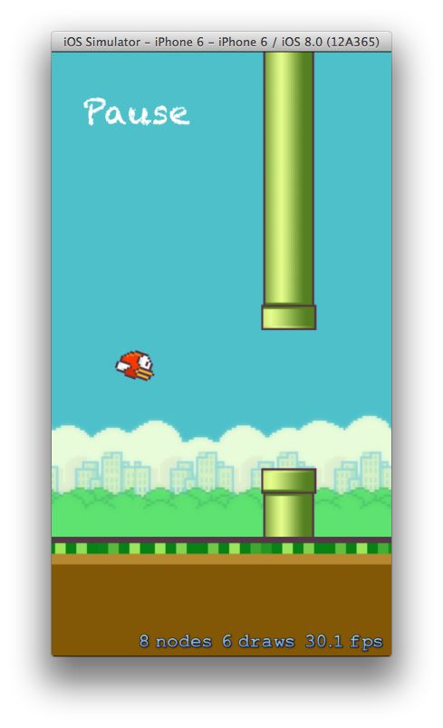

FlappyBird.app
==============

This is the demo game built for my Sprite Kit talk at #inspect 2014 in San Francisco. If you would like to see the slides that accompanied this code you can find them here on Speaker Deck:

https://speakerdeck.com/willrax/skfun

I've tried to provide examples of how you can do contact and scrolling using two different methods. In both cases these are commented out. You can uncomment to see the difference between the two.

One great example of why actions are so good is the background scrolling. At the moment the background doesn't use any actions so when you pause the game it continues to scroll. If we wanted to pause these nodes as well we would have to manually stop that movement. All the other nodes that are moved by actions are paused. ACTIONS!

Any questions, let me know! https://twitter.com/willrax

You can find the slides for the talk [here](https://speakerdeck.com/willrax/skfun) and the video for the talk [here](https://www.youtube.com/watch?v=bj1hJS1lGdU).

---

Kudos to:

- https://twitter.com/dongatory
- https://github.com/gogogarrett/hogger/ (Built with @gogogarrett at a hack night)
- http://www.raywenderlich.com/51108/build-spaceinvaders-in-spritekit-part-1-of-2
- http://www.raywenderlich.com/51108/build-spaceinvaders-in-spritekit-part-2-of-2
- http://pragprog.com/book/pssprite/build-ios-games-with-sprite-kit
- http://digitalbreed.com/2014/how-to-build-a-game-like-flappy-bird-with-xcode-and-sprite-kit
