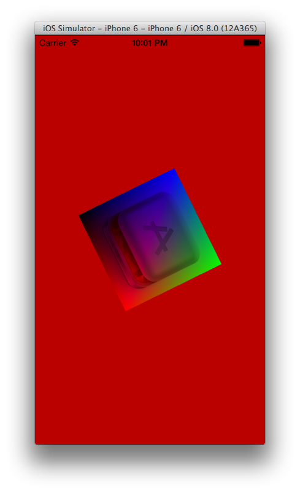

HelloGL.app
===========

This sample demonstrates the following concepts: GLKit (OpenGL).

This sample has been contributed by Pete Schwamb. It's basically a port of
Ray Wenderlich's code in his nice GLKit tutorial.

https://github.com/ps2/MotionGL
http://www.raywenderlich.com/5223/beginning-opengl-es-2-0-with-glkit-part-1
