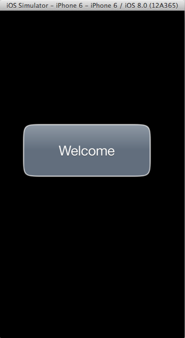

MoveMeRuby.app
==============

This sample app demonstrates simple drawing, touch handling, and animation using UIKit and Core Animation.

When you touch inside the placard, it pulses and centers under the touch point. You can then move it around the screen and it stays centered on the touch. When you remove your finger, the placard moves back to the center of the screen and bounces.

Double-tapping outside of the placard displays the welcome message in a different language. The list of messages is stored in the UTF16-encoded file 'resources/DisplayStrings.txt'.

This is a Ruby port of the original Objective-C project from the iOS sample code: http://developer.apple.com/library/ios/#samplecode/moveme/Introduction/Intro.html

The initial port was done by Steven R. Farley <srfarley@gmail.com>.
