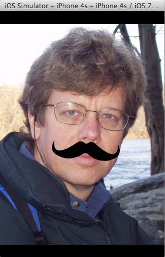

Mustache.app
============

This sample demonstrates the following concepts: Images, Face Recognition, Gestures.

The code was inspired from a similar MacRuby sample, and only works on an iPhone 4 resolution (use ``rake device_name="iPhone 4"`` for the simulator).
