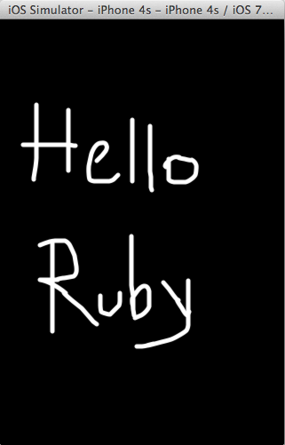

PaintHTML.app
=============

This sample demonstrates the following concepts: WebView, HTML5 backend.

This sample shows how to wrap a full-screen HTML5 app into a RubyMotion app.
It was contributed by Thijs van der Vossen.

https://github.com/tvandervossen/motion-webview
