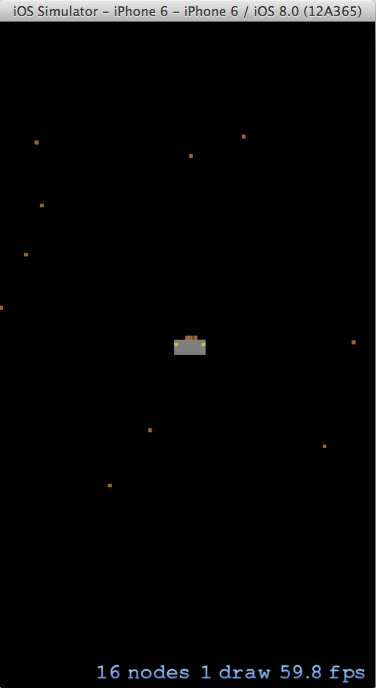

SpaceRocks.app
==============

This sample demonstrates the following concepts from SpriteKit: SKScene, SKNode and SKPhysicsBody.

The original Objective-C code can be found in the Apple guide [Jumping in to SpriteKit](https://developer.apple.com/library/ios/documentation/GraphicsAnimation/Conceptual/SpriteKit_PG/GettingStarted/GettingStarted.html).
